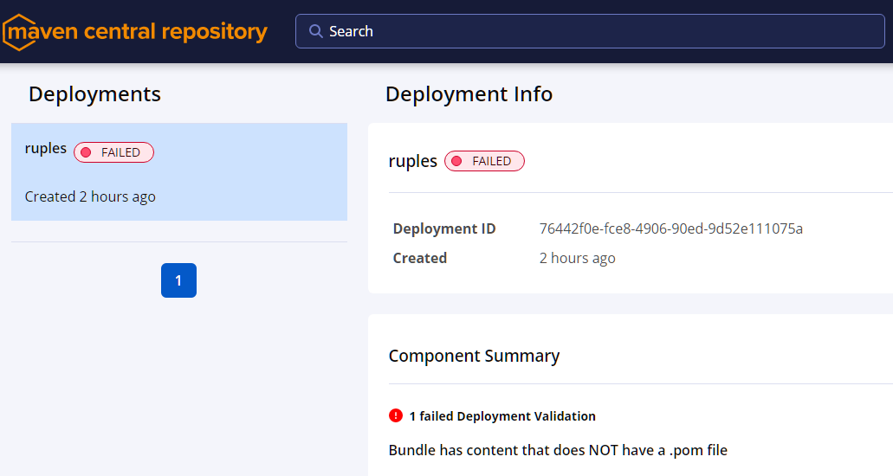

# Issue Report ─ Challenges Publishing to Maven Central

## Context

The goal is to publish/deploy the JAR artifact to the **Maven Central Repository**, with adherence to the Maven's & Sonatype guidelines and procedures.

Date of execution: *2024-12|4/5*

## General Procedure 

Below the general sequence of steps performed, resulting in this Version [1.1]:


1. **Modify the project coordinates in the POM** as required by  [Maven Central](https://central.sonatype.com).
2. **Add metadata information** Developer, SCM, repository, license, etc.  
3. **Create a specific deployment profile** (release).  
4. **Link the GitHub account to the Maven Central Repository.**  
5. **Add configuration in Maven's settings.xml file** for servers, credentials, tokens, etc.  
6. **Synchronize configuration between `settings.xml` and `POM.xml`.**  
7. **Modify the source code to use a valid namespace**, resulting in changes to source code package naming, as required by Maven Central's new specifications.  
8. **Set up GnuPG (GNU Privacy Guard)** to generate signed artifacts as required.  
9. **Adhere to standardized mechanisms for securely using, storing, and sharing credentials** for GnuPG and Maven Central tokens across the Project Object Model, Maven settings file, Maven build tool, GitHub, and GitHub Workflows.  
10. **Implementation of a GitHub workflow**, to automate deployment to Maven Central.  
11. **Validate local deployment** using different Maven plugins as mentioned in the documentation.  
12. **Execute manual deployment**, encountering unclear or ambiguous error validation messages.

## Attempted Methods

### 1. Automatic deployment

   - After configuration ─as outlined in section above─, the `central-publishing-maven-plugin` was used within a dedicated release profile.
   - Credentials for the `central` server were provided in `settings.xml`.
   - This approach resulted in a *401 error* with the message: *"Content access is protected by token"*, despite of validating different Maven plugins the documentation suggest.
   - The same was done for the other plugins like `nexus-staging-maven-plugin`, with different configurations, but none of those was the solution, although, first attempt to deploy was able to upload files to the Maven Central Respository, since feedback was received after execution via maven-command-line, such feedback was the origin to implement the changes for this new version.


### 2. Manual deployment via Maven Central Repository

   - The JAR, POM, source code, and Javadoc and its signature-files were packaged into a single bundle (`bundle.jar`).
   - An attempt was made to upload the bundle through the Maven Central website.
   - This approach resulted in an error stating *"Bundle has content that does NOT have a .pom file"*.

## Troubleshooting efforts

- Extensive documentation review was conducted, including resources from Maven/Sonatype Central:

    - [https://central.sonatype.org/publish/publish-portal-maven](https://central.sonatype.org/publish/publish-portal-maven)
    - [https://central.sonatype.org/pages/support/#credentials](https://central.sonatype.org/pages/support/#credentials)
    - [https://central.sonatype.org/faq/registered-on-portal-oss-errors](https://central.sonatype.org/faq/registered-on-portal-oss-errors)
    - [https://central.sonatype.org/publish/publish-manual](https://central.sonatype.org/publish/publish-manual)

- Alternatives like the deprecated `nexus-staging-maven-plugin` were explored but resulted in compatibility issues.

## Identified Issues

1. **Credential Compatibility:** It's unclear if credentials/tokens generated in `https://central.sonatype.com` are valid for `s01.oss.sonatype.org`, although simple website log-in attempt and maven's deployment via plugin indicates they aren't. The documentation for `central-publishing-maven-plugin` lacks clarity regarding the target server for deployment.

2. **Legacy OSSRH Method:** Due to platform migration, there seems to be no way to directly access `s01.oss.sonatype.org` to request credentials for the legacy *OSSRH (OSS Repository Hosting)* method, morevover the `nexus-staging-maven-plugin` plugin execution throws compatibility exceptions when run.


## Maven deployment plugins that were validated

```xml    

    <!--(1) [central-publishing-maven-plugin]
            The only configuration+plugin that seems to be valid, 
            but despite providing the tokens, raises: error 401:
            => "401, reason phrase: Content access is protected by token"

        (2) manual publishing through https://central.sonatype.com/publishing
        raises: "Bundle has content that does NOT have a .pom file"

        jar -cvf bundle.jar ruples-1.0.pom ruples-1.0.pom.asc ruples-1.0.jar ruples-1.0.jar.asc 
                ruples-1.0-javadoc.jar ruples-1.0-javadoc.jar.asc ruples-1.0-sources.jar ruples-1.0-sources.jar.asc 
        
        (*)
        mvn dependency:purge-local-repository
        mvn clean install
        mvn clean deploy -P release [ -X -e ] 
    -->
    
    <plugin>
    <groupId>org.sonatype.central</groupId>
    <artifactId>central-publishing-maven-plugin</artifactId>
    <version>0.6.0</version>
    <extensions>true</extensions>
    <configuration>
        <publishingServerId>central</publishingServerId>
        <autoPublish>true</autoPublish>
    </configuration>
    <executions>
        <execution>
        <id>deploy-jar-to-central</id>
        <phase>deploy</phase>
        <goals>
            <goal>publish</goal>
        </goals>
        </execution>
    </executions>
    </plugin>

    <!-- 
    This plugin is no-longer-supported raises exceptions.
    This plugin was the standard previous to migration.
    -->
    <plugin> 
    <groupId>org.sonatype.plugins</groupId>
    <artifactId>nexus-staging-maven-plugin</artifactId>
    <version>1.6.7</version>
    <extensions>true</extensions>
    <configuration>
        <serverId>ossrh</serverId>
        <nexusUrl>https://s01.oss.sonatype.org/</nexusUrl>
        <autoReleaseAfterClose>true</autoReleaseAfterClose>
    </configuration>
    </plugin>    

    <!-- Different distribution-management setting were validated -->
    <distributionManagement>
      <repository>
        <id>central</id> <!-- central.sonatype.com -->
        <url>https://s01.oss.sonatype.org/service/local/staging/deploy/maven2/</url>
      </repository>
      <snapshotRepository>
        <id>central</id>
        <url>https://s01.oss.sonatype.org/content/repositories/snapshots</url>
      </snapshotRepository>
    </distributionManagement>
```

## Summary

Despite extensive efforts, a task that could be straightforward as publishing to Maven Central seems to be tedious and ambiguous. This complexity/obfuscation may be caused from Maven Central’s ongoing migration from file-system storage to blob-storage, which involves significant technical challenges. Additionally, some references in the documentation are outdated, dating back over a decade. The identified issues require further investigation to ensure proper configuration, accurate token and credential provisioning, and more comprehensive/complete feedback from the automated Maven's validation process.


___


## Screenshots





